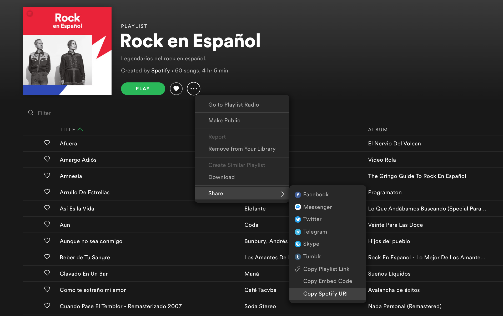
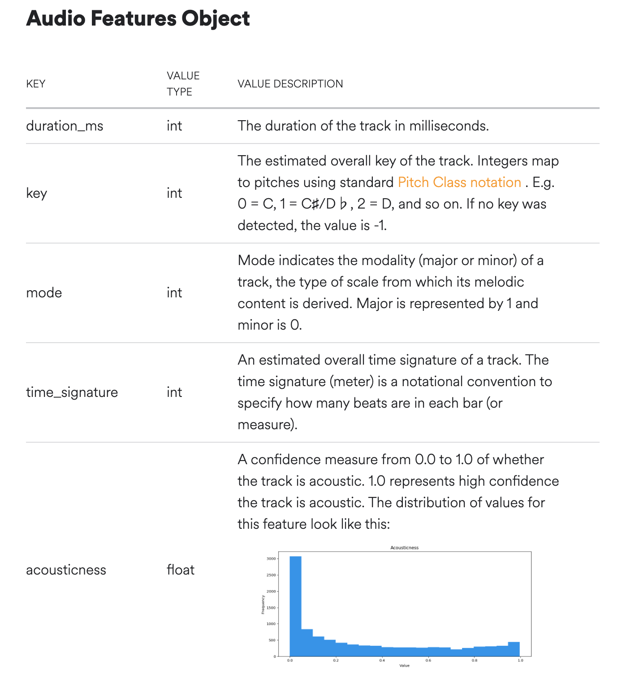
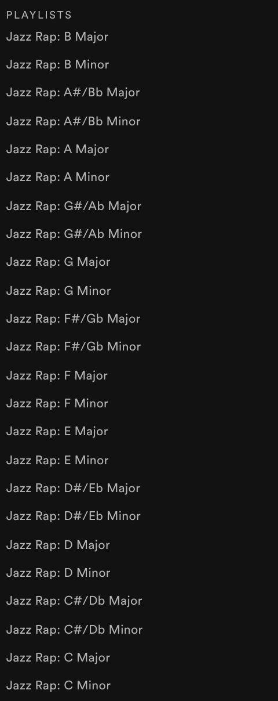

# Organize playlists by key on Spotify
**KeyMaster** takes any Spotify playlist and creates new playlists, grouped by key and mode (e.g. B Minor, A Major, etc.). 

1. The user is asked to enter a playlist's URI. For example, the URI for the Spotify-curated playlist **"Rock en Español"** is **spotify:playlist:37i9dQZF1DWYN0zdqzbEwl**.

2. **KeyMaster** begins an OAuth authorization process to obtain permission from the user to create playlists on their behalf on Spotify.

More info can be found [here](https://developer.spotify.com/documentation/general/guides/authorization-guide/#authorization-code-flow).

3. The app receives a *code* from Spotify's Accounts Service (their authorization API), which is then exchanged for a short-lived *access-token* that can be used to communicate with Spotify's Web API to retrieve playlist and track information, as well as to create playlists, add tracks to playlists, etc. 

4. The app then gets information on the tracks from the playlist that the user entered. Spotify's API offers information on a track's "audio features", which includes key and mode, as well as other interesting analysis like 'danceability', 'instrumentalness' and more.

5. Once tracks are entered into a table in a database along with their information, new playlists are created on the user's behalf on Spotify. These playlists are private and only visible to the user. Tracks are then added to the corresponding playlists.

